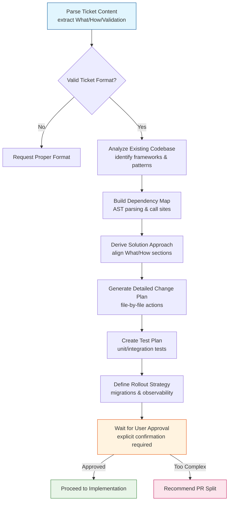
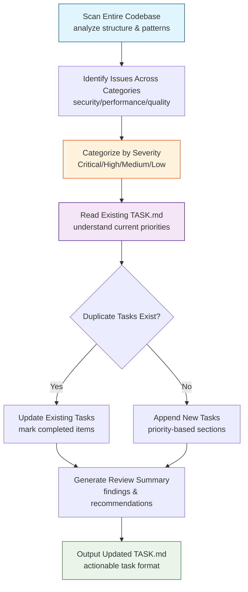
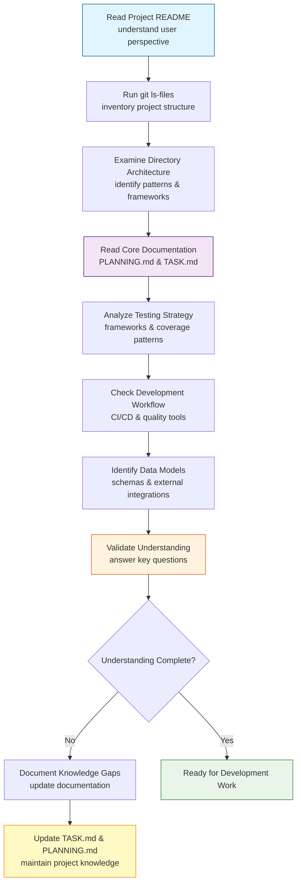

# classy_claude_commands
Here lays our best CCC (Classy Claude Commands)

## Function Flowcharts

This section illustrates the main workflows of our most complex Claude Code commands using Mermaid flowcharts.

### 1. Implement Notion Ticket Workflow

The `implement_notion_ticket` command orchestrates a comprehensive workflow for converting Notion tickets into detailed Python implementation plans. This process ensures thorough analysis before any code is written.

### 2. Code Review Process Workflow

The `code_review` command implements a systematic code analysis process that prioritizes findings and maintains project documentation through TASK.md integration.

### 3. Project Understanding Workflow

The `prime` command provides a systematic approach to understanding any new codebase through structured analysis of documentation, structure, and dependencies.

